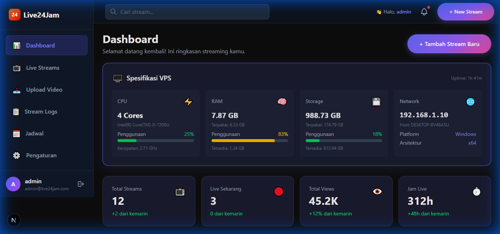
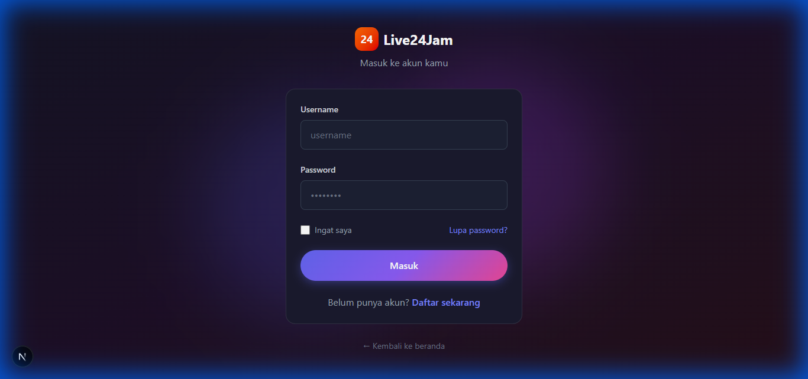
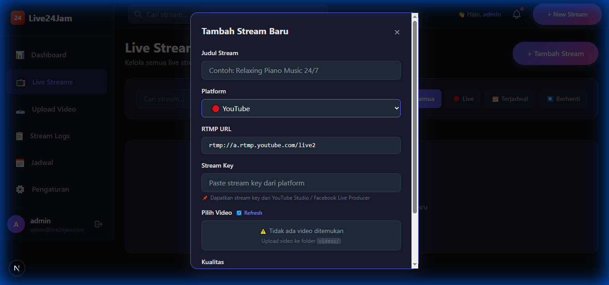
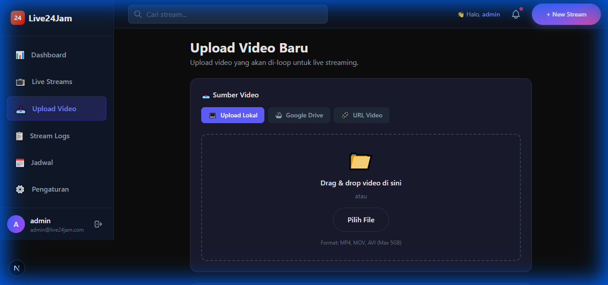

# 🎬 Live24Jam - Platform Live Streaming 24/7

Platform live streaming otomatis untuk YouTube, Facebook, TikTok, Twitch, dan platform RTMP lainnya.


## 📸 Screenshots

### Dashboard dengan VPS Monitoring


### Login Page


### Multi-Platform Streaming (YouTube, TikTok, Twitch, dll)


### Upload Video dengan Drag & Drop


## ✨ Fitur Utama

- 📺 **Multi-Platform** - YouTube, Facebook, TikTok, Twitch, Instagram, Custom RTMP
- 🔄 **Stream Copy Mode** - Hemat CPU dengan mode copy (tanpa re-encoding)
- 🔁 **Auto-Restart** - Otomatis restart jika stream terputus (max 5 retries)
- 📤 **Upload Video** - Drag & drop dengan progress bar
- 🔐 **Autentikasi JWT** - Login aman dengan JWT token
- 📊 **VPS Monitoring** - Pantau CPU, RAM, Disk, Network real-time
- 📋 **Stream Logs** - Lihat log FFmpeg secara real-time

## 🚀 Quick Start (Development)

```bash
# Clone repository
git clone https://github.com/Fransloverz/Live24Jam.git
cd Live24Jam

# Install dependencies
npm install

# Jalankan development server
npm run dev        # Frontend (port 3000)
npm run server     # Backend API (port 3001)

# Atau jalankan keduanya sekaligus
npm run dev:all
```

Buka [http://localhost:3000](http://localhost:3000)

**Default Login:**
- Username: `admin`
- Password: `admin123`

---

## 🖥️ Deploy ke VPS

### Persyaratan VPS

| Komponen | Minimum | Rekomendasi |
|----------|---------|-------------|
| RAM | 1 GB | 2 GB+ |
| CPU | 1 Core | 2 Core+ |
| Storage | 10 GB | 50 GB+ |
| OS | Ubuntu 20.04+ | Ubuntu 22.04 |

### Step 1: Siapkan VPS

```bash
# Update sistem
sudo apt update && sudo apt upgrade -y

# Install Node.js 18+
curl -fsSL https://deb.nodesource.com/setup_18.x | sudo -E bash -
sudo apt install -y nodejs

# Install FFmpeg (WAJIB untuk streaming)
sudo apt install -y ffmpeg

# Install PM2 (process manager)
sudo npm install -g pm2

# Install Nginx (reverse proxy)
sudo apt install -y nginx

# Verifikasi instalasi
node --version    # v18.x.x
npm --version     # 9.x.x
ffmpeg -version   # ffmpeg version x.x
```

### Step 2: Clone & Setup Project

```bash
# Buat direktori project
sudo mkdir -p /var/www/live24jam
sudo chown $USER:$USER /var/www/live24jam
cd /var/www/live24jam

# Clone repository
git clone https://github.com/Fransloverz/Live24Jam.git .

# Install dependencies
npm install

# Build frontend untuk production
npm run build

# Buat folder videos
mkdir -p videos
```

### Step 3: Konfigurasi Environment

```bash
# Buat file environment
nano .env
```

Isi dengan:

```env
# Server
NODE_ENV=production
API_PORT=3001

# JWT Secret (GANTI dengan string random yang panjang!)
JWT_SECRET=ganti-dengan-secret-key-yang-sangat-panjang-dan-random-123456

# Video Directory
VIDEOS_DIR=/var/www/live24jam/videos

# Frontend API URL (sesuaikan dengan domain Anda)
NEXT_PUBLIC_API_URL=http://YOUR_VPS_IP:3001
```

### Step 4: Jalankan dengan PM2

```bash
# Buat ecosystem file
nano ecosystem.config.js
```

Isi dengan:

```javascript
module.exports = {
  apps: [
    {
      name: 'live24jam-frontend',
      script: 'npm',
      args: 'start',
      cwd: '/var/www/live24jam',
      env: {
        NODE_ENV: 'production',
        PORT: 3000
      }
    },
    {
      name: 'live24jam-backend',
      script: 'server/index.js',
      cwd: '/var/www/live24jam',
      env: {
        NODE_ENV: 'production',
        API_PORT: 3001
      }
    }
  ]
};
```

Jalankan:

```bash
# Start semua aplikasi
pm2 start ecosystem.config.js

# Simpan konfigurasi PM2 agar auto-start saat reboot
pm2 save
pm2 startup

# Cek status
pm2 status
pm2 logs
```

### Step 5: Konfigurasi Nginx

```bash
# Buat konfigurasi Nginx
sudo nano /etc/nginx/sites-available/live24jam
```

Isi dengan:

```nginx
server {
    listen 80;
    server_name YOUR_DOMAIN_OR_IP;

    # Frontend Next.js
    location / {
        proxy_pass http://localhost:3000;
        proxy_http_version 1.1;
        proxy_set_header Upgrade $http_upgrade;
        proxy_set_header Connection 'upgrade';
        proxy_set_header Host $host;
        proxy_cache_bypass $http_upgrade;
        proxy_set_header X-Real-IP $remote_addr;
        proxy_set_header X-Forwarded-For $proxy_add_x_forwarded_for;
    }

    # Backend API
    location /api {
        proxy_pass http://localhost:3001;
        proxy_http_version 1.1;
        proxy_set_header Upgrade $http_upgrade;
        proxy_set_header Connection 'upgrade';
        proxy_set_header Host $host;
        proxy_cache_bypass $http_upgrade;
        proxy_set_header X-Real-IP $remote_addr;
        proxy_set_header X-Forwarded-For $proxy_add_x_forwarded_for;
        
        # Untuk upload file besar
        client_max_body_size 10G;
        proxy_read_timeout 300;
        proxy_connect_timeout 300;
        proxy_send_timeout 300;
    }
}
```

Aktifkan konfigurasi:

```bash
# Enable site
sudo ln -s /etc/nginx/sites-available/live24jam /etc/nginx/sites-enabled/

# Test konfigurasi
sudo nginx -t

# Restart Nginx
sudo systemctl restart nginx
sudo systemctl enable nginx
```

### Step 6: Setup SSL (Opsional tapi Direkomendasikan)

```bash
# Install Certbot
sudo apt install -y certbot python3-certbot-nginx

# Generate SSL certificate
sudo certbot --nginx -d yourdomain.com

# Auto-renew
sudo certbot renew --dry-run
```

### Step 7: Firewall

```bash
# Buka port yang diperlukan
sudo ufw allow 22      # SSH
sudo ufw allow 80      # HTTP
sudo ufw allow 443     # HTTPS
sudo ufw enable
```

---

## 📁 Struktur Folder di VPS

```
/var/www/live24jam/
├── app/                 # Next.js frontend
├── server/              # Express backend
│   ├── routes/          # API routes
│   ├── services/        # FFmpeg service
│   └── data/            # JSON database
├── videos/              # Video files untuk streaming
├── .next/               # Next.js build output
├── node_modules/
├── ecosystem.config.js  # PM2 config
├── .env                 # Environment variables
└── package.json
```

---

## 🔧 Maintenance Commands

```bash
# Update aplikasi
cd /var/www/live24jam
git pull
npm install
npm run build
pm2 restart all

# Lihat logs
pm2 logs live24jam-frontend
pm2 logs live24jam-backend

# Restart aplikasi
pm2 restart all

# Stop aplikasi
pm2 stop all

# Monitor resources
pm2 monit
```

---

## 🎥 Cara Streaming

1. **Upload Video** - Upload file MP4 (H.264/AAC) ke folder `videos/` atau via dashboard
2. **Tambah Stream** - Pilih platform dan masukkan Stream Key
3. **Start Stream** - Klik tombol Start
4. **Monitor** - Pantau via Stream Logs

### Mendapatkan Stream Key

| Platform | Cara Mendapatkan |
|----------|------------------|
| YouTube | YouTube Studio → Go Live → Stream Key |
| Facebook | Facebook Live Producer → Stream Key |
| TikTok | TikTok Live Studio (min 1000 followers) |
| Twitch | Twitch Dashboard → Settings → Stream Key |

---

## ⚠️ Troubleshooting

### FFmpeg Error
```bash
# Cek FFmpeg terinstall
which ffmpeg

# Install jika belum ada
sudo apt install -y ffmpeg
```

### Permission Error
```bash
# Fix permission folder videos
sudo chown -R $USER:$USER /var/www/live24jam/videos
chmod 755 /var/www/live24jam/videos
```

### Port Sudah Digunakan
```bash
# Cek process yang menggunakan port
sudo lsof -i :3000
sudo lsof -i :3001

# Kill process
sudo kill -9 <PID>
```

---

## 📄 License

MIT License - Silakan gunakan dan modifikasi sesuai kebutuhan.

---

## 🤝 Support

Jika ada pertanyaan atau masalah, silakan buat issue di GitHub.

**Made with ❤️ by Fransloverz**
